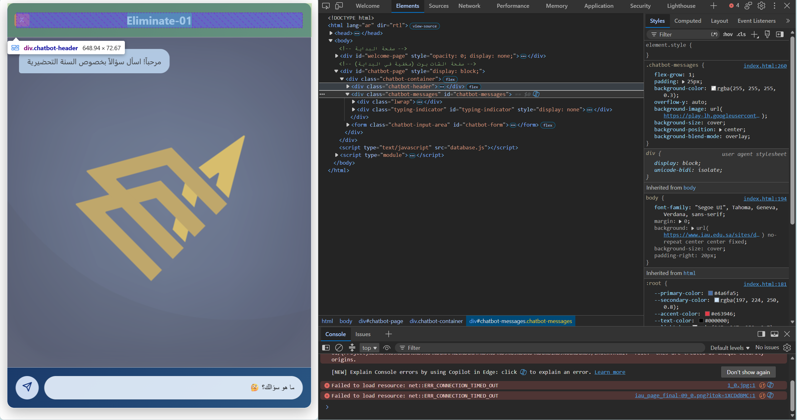
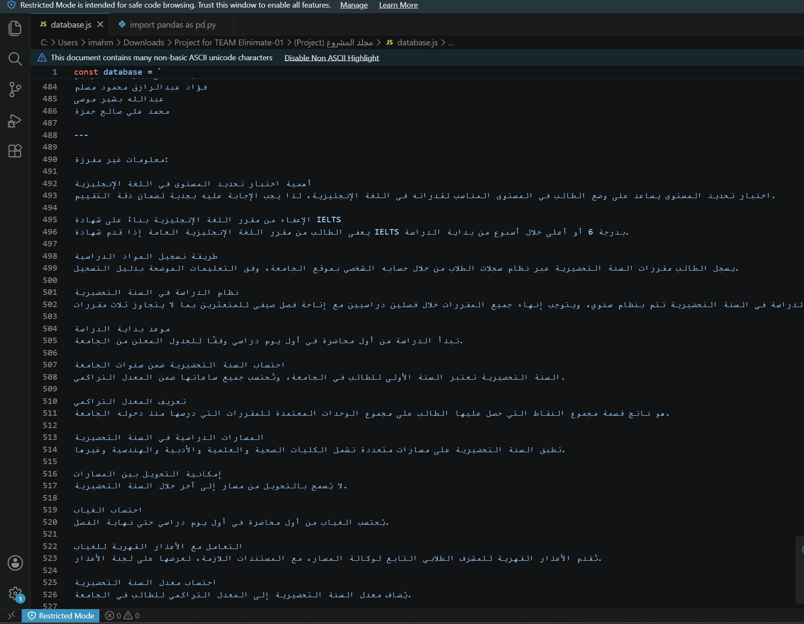

# University-AI-Chatbot
An AI-powered chatbot designed to assist university students with academic and administrative inquiries.

> 📚 This project was developed as a university project.

## 📌 About the Project

The University AI Chatbot is a conversational assistant designed to help students find information and get answers to common academic and administrative questions.

The chatbot aims to make university-related information easier to access through a simple conversational interface.

## ✨ Features

- 🤖 AI-Powered Chatbot
- 🎓 Academic Question Support
- 🏫 University Services Information
- 📚 Course and Faculty Information
- 💬 Conversational User Interface
- ⚡ Quick Responses
- 🌐 Easy Access to University Information

## 🛠️ Technologies & Tools

- DeepSeek AI
- API Integration
- HTML
- CSS
- JavaScript

## 🖥️ Screenshots

### Chat Interface

### Database

